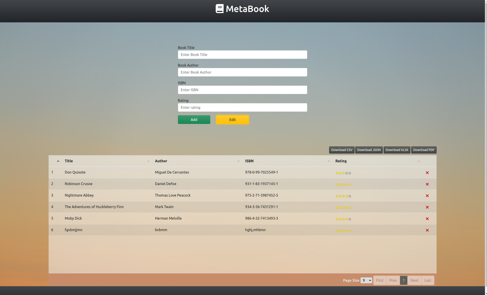
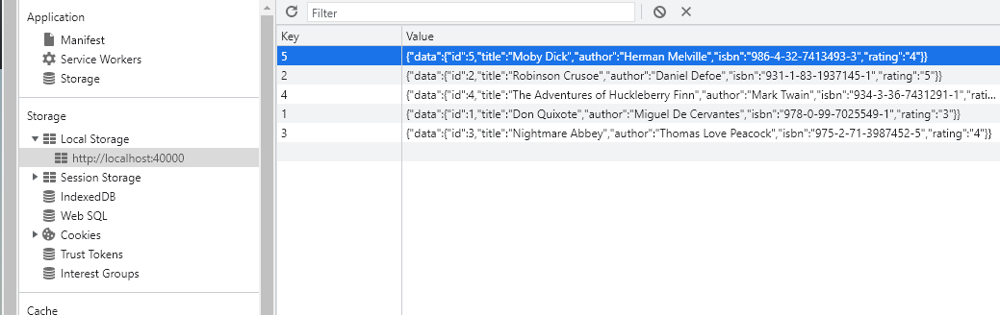

# MetaBook

## Description 
MetaBook is a CRUD (Create, Read, Update, Delete) application for book metadata management, it's using localStorage as an backend to save and retrieve the book information.

</br>
Some of the features:

* Fully responsive design.
* Ability to download the book information in variety of formats.
* Input validation
* Use of VirtualDom for large data sets
* Clipboard functionality

Same skeleton can be used for any CRUD application like inventory or notes.


## Technologies used

* Bootstrap 5 https://getbootstrap.com/docs/5.0/getting-started/introduction/
* jQuery 3.6  https://jquery.com/
* CSS Grid    https://web.dev/learn/css/grid/
* Tabulator.js    http://tabulator.info/
* Lockr   https://github.com/tsironis/lockr
* Sheet.js    https://sheetjs.com/
* JSPDF   https://parall.ax/products/jspdf

## Responsive Design and Styling
Responsive design was achieved by utilizing new CSS Grid, so there is no need for multiple media queries. </br>
Background found on https://unsplash.com/images


## App Functionality

### Main Form
* Add data to localStorage
* Show data from localStorage in table

App will add the book ID by itself, it will scan the localStorage for keys and add +1 to the key with the largest number
</br>

* Input validation
    * Prevents empty entries
    * Number validation
    * Range validation

* Alert on sucessful add to localStorge

### Edit Form
* Add or modify the data in localStorage 
* Show modified data in the table
* Input validation
    * Prevents empty entries
    * Number validation
    * Range validation

* Alert on succesfull record modification or add

By default, modal is not going to close by itself in case you want to enter multiple records in a row, to exit - click on cancel or anywhere outside of form to close the modal.

</br>
If the key (ID) exists, record will be modified, if not, new record will be added to localStorage.
 

### Table functionality
#### Sorting
* Each column can be sorted asc/desc by either string or number, default sort is on ID column

#### Pagination
* Pagination and page size options

#### Virtual DOM rendering
* Supports on the fly loading of huge data sets

#### Delete data
* Click on the X button to remove the entries from localStorage and the table, it will trigger the delete alert on success.

#### Copy to and from Clipboard
* Click on table and press ctrl+c to copy entire table to the clipboard, you can then paste it to something like Excel sheet.

* Don't want to enter data manually? Just copy the properly formtted data from Excel, click on the table and paste it in, that way you can import data in bulk without going one by one through the form.

#### Downloads in multiple formats
* CSV
* JSON
* XLSX - powered by Sheets.js
* PDF - powered by JSPDF

### Screenshots

MetaBook main page
</br>



Form validation
</br>


Edit Form
</br>


localStorage

<br/>



</br>

## Testing

#### Windows 10
* Edge - version 100.0.1185.39
* Chrome - version 101.0.4951.41
* Firefox - version 99.0.1

#### Ubuntu 22.04
* Chrome - version 101.0.4951.41
* Firefox - 99.0.1

#### iPadOS
* Safari - version 15.3

Multiple resolutions tested

No bugs found after testing

### Code  Validation 
#### HTML validation
##### w3c HTML validator
* index.html passes the official w3 validator https://validator.w3.org/index.html

#### CSS validation
##### w3C Jigsaw CSS validator
* style.css passes the official CSS vlidator https://jigsaw.w3.org/css-validator/validator 


#### JS validation
##### JSLint
Doesn't seem to like jquery way of writting code since:

"JSLint defines a professional subset of JavaScript, a stricter language than that defined by Edition 3 of the ECMAScript Language Specification. The subset is related to recommendations found in Code Conventions for the JavaScript Programming Language."

</br>
Meaning it's using a "safe" subset of Javascript that is unlikly to break accross JS implementations.

As such it throws errors on basic jquery code such as:
> $(document).ready(function() {})

</br>
It also completley brakes on jquery validation plugin where it tries to rearange the validation object which is clearly wrong and it wouldn't work, same goes even for default setup for Tabulator.js

</br>

##### Esprima
Syntax validation passes on Esprima (https://esprima.org/demo/validate.html) which is not opinionated about coding styles and formating (eg. JSLint's "use spaces instead of tabs")

</br>

##### JSHint
Validation passed on JSHint

Notes: 
To properly lint the jquery with es6 syntax, add these lines to top of your .js file

```
 /* globals $:false */ 
 /* jshint esversion: 6 */ 
```

or add this to your .jshintrc file </br>

``` 
  "globals": {
    "esversion": 6,
    "$": false,
    "jQuery": true
  }
  ```

## Deployment 
### Local
To locally deploy the project clone the Git repository with

>git clone https://github.com/Azelliott/meta-book.git

### Demo
To visit live demo of the project on GitHub Pages go to:

>https://azelliott.github.io/meta-book/